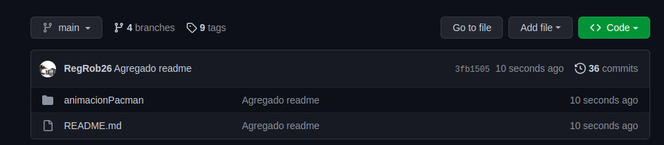
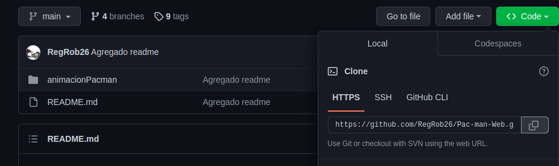

# 
 Pac-Man

 Manual técnico

***
*Sobre el proyecto*

   * Implementacion del videojuego Pac-man haciendo uso del componente canvas y funciones del lenguaje de pprogramcion
    Javascript. Por lo que se despliega en la web.
   * Versión: 1.0

*Sobre el autor*

* Nombre: Emmanuel Guadalupe Robles Robles
* Correo electrónico: <rore021226@gs.utm.mx>
* Repositorio: <https://github.com/RegRob26>
***

1. [Objetivos](#1)
2. [Alcance](#2)
3. [Requerimientos](#3)
4. [Herramientas utilizadas](#4)
5. [Instalacion](#5)
6. [Consulta de documentación](#6)
7. [Uso de HTML y CSS](#7)

***

<a name="1">

## Objetivos
</a>
   Implementar una adaptación del videojuego Pac-Man, con los conicimientos adquiridos durante las clases de la materia
   programación web.

***

<a name="2">

## Alcance
</a>
Este documento está dirigido hacia quien esté interesado en revisar el código del proyecto y el proyecto en sí mismo. 
Además de a quienes deseen aportar al videojuego.

***
<a name="3">

## Requirimientos
</a>

El proyecto se visualizó mediante el navegador Chrome. Por lo que este es un requisito para la visualización,
ya que no se garantiza el funcionamiento con otros navegadores web.
    

***
<a name="4">

## Herramientas utilizadas
</a>

Para la implementación del proyecto se hizo uso de las siguientes tecnologías:

Lenguaje de programación:

* Javascript

Modelado de página web:

* HTML5
* CSS

Generación de documentación:

* Jsdoc
* Markdown

---
<a name="5">

## Instalación
</a>

Para poder hacer uso del proyecto o bien consultar el código fuente, se puede clonar el repositorio fuente mediante los
siguientes pasos:
1. Acceder al siguiente link:

*      https://github.com/RegRob26/Pac-man-Web

2. Seleccionar el botón verde (code):

3. Copiar el link de la pestaña https:

4. Abrir una consola dentro de la computadora y ejecutar el siguiente comando
*        git clone [link_del_paso_3]

5. Ahora tendrás en tu computadora la carpeta del proyecto y podrás modificarlo o probarlo

----
<a name="">

## Consulta de documentación

</a>

Si estás viendo este documento desde la página generada por jsdoc, del lado derecho de la pantalla te aparecerán todas
las funciones y una breve explicación además de ciertes variables utilizadas durante el proyecto.
De otra manera, esta información se puede consultar directamente sobre el código del proyecto
*            scriptPacman.js
